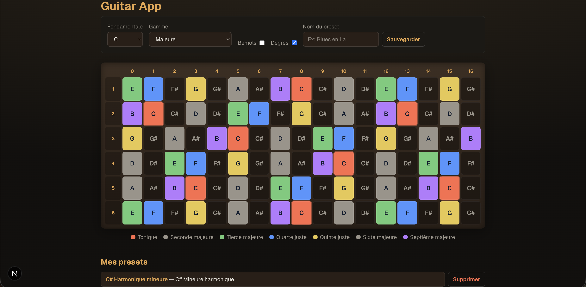
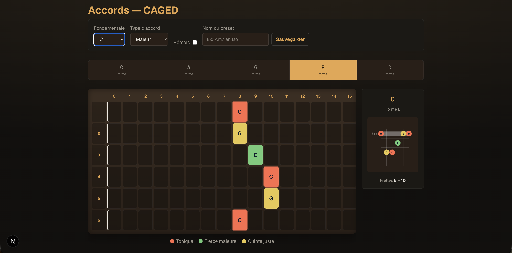

# Guitar App — Manche interactif full-stack

[Live demo](https://formation-fullstack.vercel.app/) · [API](https://formation-fullstack-production.up.railway.app/health)

Application web pour visualiser **gammes** et **accords** sur le manche d'une guitare. Logique musicale servie par une **API FastAPI** (Python), UI et données utilisateur par **Next.js** (TypeScript).

## Architecture polyglotte

```
┌─────────────────────────────┐         ┌──────────────────────────────┐
│  Next.js — Vercel           │  HTTP   │  FastAPI — Railway           │
│  • UI React                 │ ──────► │  • Gammes / accords / degrés   │
│  • Auth Google (Auth.js)    │         │  • Harmonisation + progressions│
│  • Presets (Prisma + Neon)  │         │  • Tests pytest                │
└─────────────────────────────┘         └──────────────────────────────┘
```

| Projet | Dossier | URL prod |
|---|---|---|
| Front | `semaine-02-guitar-app` | https://formation-fullstack.vercel.app |
| API | `semaine-03-guitar-api` | https://formation-fullstack-production.up.railway.app |

## Captures d'écran

### Page Gammes — manche, harmonisation et progressions IA



### Page Accords — système CAGED



## Fonctionnalités

### Page Gammes

- 22 gammes via API (`GET /scales`)
- Notes surlignées via API (`GET /scales/{name}/notes`)
- Degrés colorés (styles via `GET /degrees/styles`)
- **Harmonisation diatonique** via API (`GET /scales/{name}/harmonization`) — 7 accords + progressions classiques (mode adapté auto pour blues / pentatoniques)
- **Progressions IA** via API (`POST /recommend/chords`) — suggestions créatives, bouton Rafraîchir, choix du **nombre d’accords** (3–8)
- **Mode lecture** : bouton **Lire** sur progressions IA, progressions courantes (harmonisation) et presets → page Accords avec enchaînement + son (Web Audio), BPM, boucle, métronome
- **Presets utilisateur** (Neon, compte Google) :
  - gamme (tonique + échelle)
  - **progression IA** : nom libre, accords + contexte gamme ; au rechargement, pas de nouvel appel IA tant qu’on ne rafraîchit pas
- Persistance de la sélection (tonique, gamme, bémols, degrés, nombre d’accords IA) entre les pages
- Thème clair / sombre (navbar)

### Page Accords (CAGED)

- Types d'accords + positions via API
- Doigtés calculés via API (`GET /chords/frets`)
- Diagramme SVG thématisé (même bois que le manche)
- Persistance de la sélection (fondamentale, type, position CAGED)
- Presets accords avec position CAGED
- Lecteur de progression (quand lancé depuis Gammes)

### Authentification

- Google OAuth, sessions en base, données isolées par `userId`

## Stack technique

| Couche | Technologie |
|---|---|
| Front | **Next.js 16**, React 19, TypeScript, Tailwind v4 |
| API | **FastAPI**, Python 3.12+, Uvicorn, pytest |
| Base | **Neon** Postgres, **Prisma 7** |
| Auth | **Auth.js v5** + Google OAuth |
| IA | Groq (prod) / Ollama (local) / OpenAI optionnel |
| Deploy | **Vercel** (front) + **Railway** (API) |

## Démarrage local (2 terminaux)

**Terminal 1 — API :**
```bash
cd semaine-03-guitar-api
source .venv/bin/activate
pip install -r requirements.txt
uvicorn main:app --reload --port 8000
```

**Terminal 2 — Front :**
```bash
cd semaine-02-guitar-app
pnpm install
cp .env.example .env   # remplir DATABASE_URL, AUTH_*, GUITAR_API_URL
pnpm prisma db push
pnpm dev
```

### Variables d'environnement (front)

| Variable | Description |
|---|---|
| `DATABASE_URL` | Neon Postgres |
| `AUTH_SECRET`, `AUTH_GOOGLE_ID`, `AUTH_GOOGLE_SECRET` | Auth.js |
| `GUITAR_API_URL` | API serveur (`http://127.0.0.1:8000`) |
| `NEXT_PUBLIC_GUITAR_API_URL` | API client (`http://127.0.0.1:8000`) |

## Scripts utiles

```bash
pnpm typecheck   # tsc --noEmit (aussi lancé en CI)
pnpm lint
pnpm build
```

## Déploiement

- **Vercel** : Root Directory = `semaine-02-guitar-app` + toutes les variables ci-dessus
- **Railway** : Root Directory = `semaine-03-guitar-api` + Procfile
- **CI** : GitHub Actions (`.github/workflows/ci.yml`) — pytest API + typecheck front

---

Formation full-stack — Phases 2–4 + mode lecture de progressions (entraînement).
